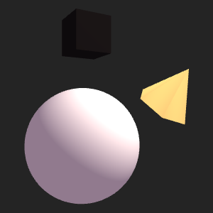

# REGL Playground

<p align="center"></p>
<p align="center">Basic WebGL scene using the <a href="https://github.com/regl-project/regl">regl</a> library</p>

- Diffuse Phong lighting using ambient & directional light
- Viewport resizing with high DPI support
- Alpha blending enabled
- GSAP integrated for animations with shared `rAF` lifecycles

## Installation

Run your preferred Node package manager  
At least **Node v16** required

```shell
pnpm install
# or
npm install
```

## Usage

This project uses [Vite⚡](https://github.com/vitejs/vite) as the bundler and dev environment  
To run the development server:

```shell
pnpm dev
# or
npm run dev
```

## Dependencies

- [regl](https://github.com/regl-project/regl): Functional WebGL wrapper
- [gsap](https://greensock.com/gsap/): Robust animation library
- [gl-matrix](https://github.com/toji/gl-matrix): Vector and matrix operations

## License

[MIT](/LICENSE)
